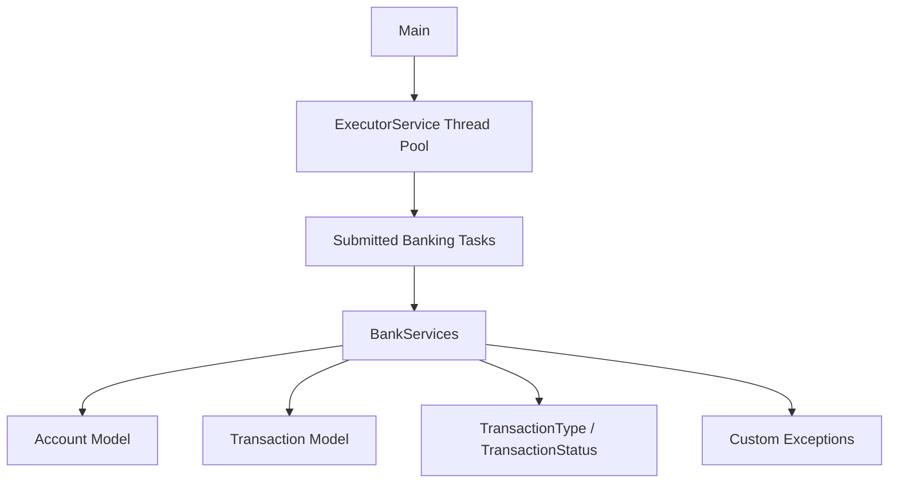

# Concurrent Banking System (Java)

A multithreaded banking simulator built in Java that models deposits, withdrawals, and transfers under concurrent load.

The project is focused on concurrency safety, transaction consistency, and stress-style execution.

<p align="center">
  
  
  
  
</p>

## Features

- Thread-safe deposit, withdrawal, and transfer operations
- Concurrent execution using `ExecutorService`
- Deadlock-safe transfer locking strategy (ordered account locking)
- Transaction history tracking per account
- Final summary with total balance validation
- Custom exceptions for invalid input and business rule failures

## Tech Stack

- Java
- `ExecutorService`
- `AtomicLong`
- `synchronized` blocks for critical sections
- Custom exception classes

## Project Structure

```text
src/
  Main.java
  Service/
    BankServices.java
  Model/
    Account.java
    Transaction.java
    TransactionStatus.java
    TransactionType.java
  Exception/
    AccountNotFoundException.java
    DuplicateAccountException.java
    insufficientBalanceException.java
    InvalidAmountException.java
  Task/
    UserTask.java
```

## Concurrency Design

- Balance-modifying operations are synchronized on account objects.
- Transfers lock both accounts in deterministic order to prevent deadlocks.
- Transaction IDs are generated with `AtomicLong`.
- Failed operations are recorded with failure status and reason.

## Architecture Overview



## How To Run

1. Open the project.
2. Set SDK to Java 21 (or your installed Java version if compatible).
3. Run `src/Main.java`.

## Sample Output (Summary)

```text
======= FINAL SUMMARY =======
Account: A101 | Holder: rakesh | Balance: 10.00
Account: A102 | Holder: suresh | Balance: 10.00
Account: A103 | Holder: ramesh | Balance: 4710.00
TOTAL BANK BALANCE: ...₹4730.00
```

## Future Improvements

- Expose operations through a REST API
- Replace coarse synchronization with `ReentrantLock` where appropriate
- Add benchmark metrics (throughput and latency)
- Add automated tests for concurrency invariants

## Author

Shubh Jaiswal  
Computer Science Student | Backend and Java Enthusiast


